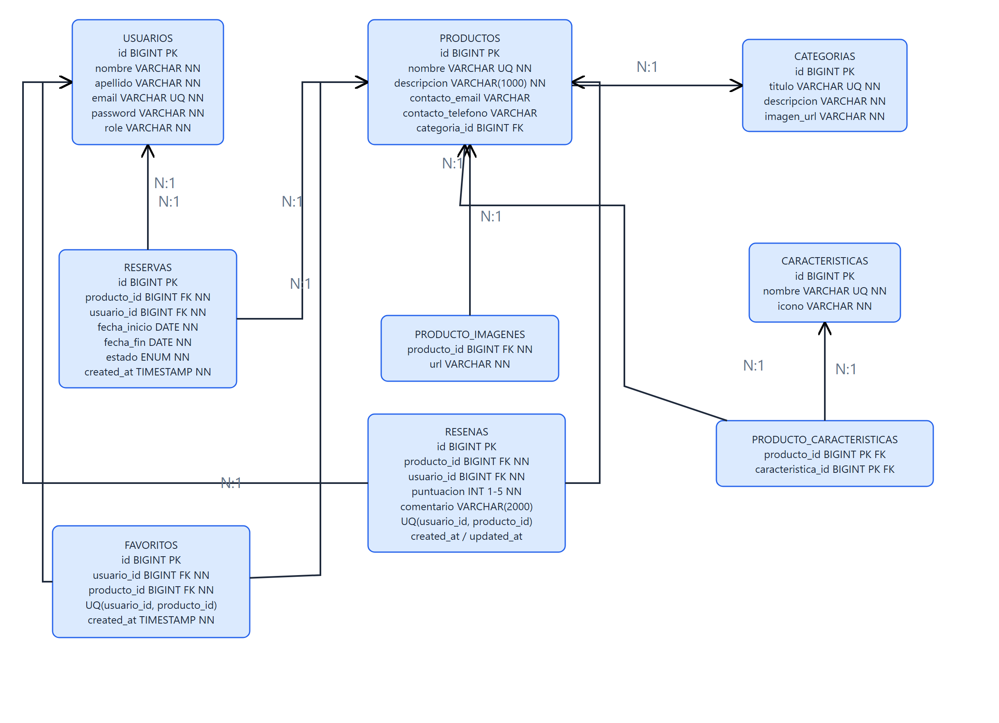
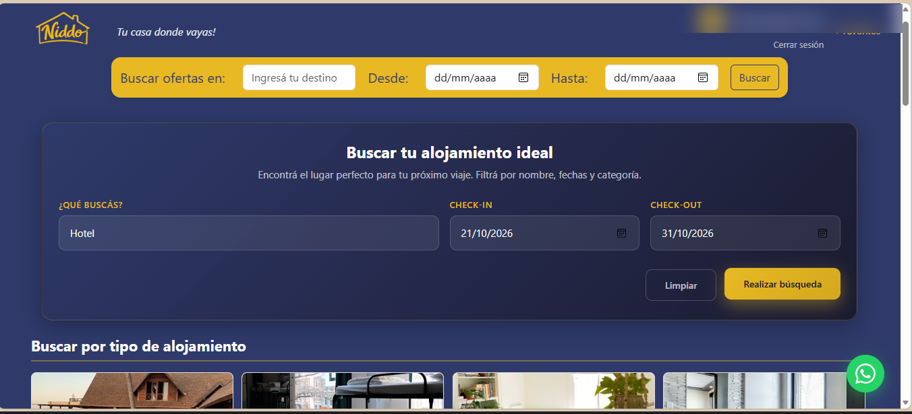
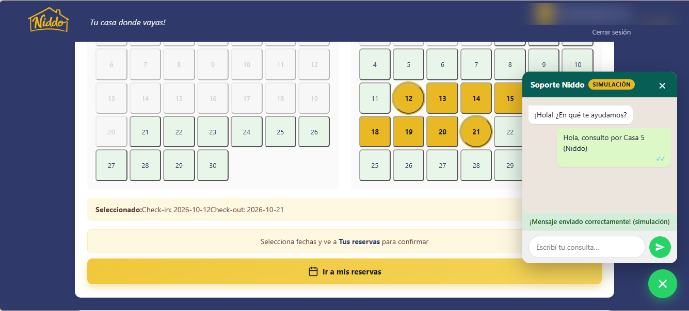
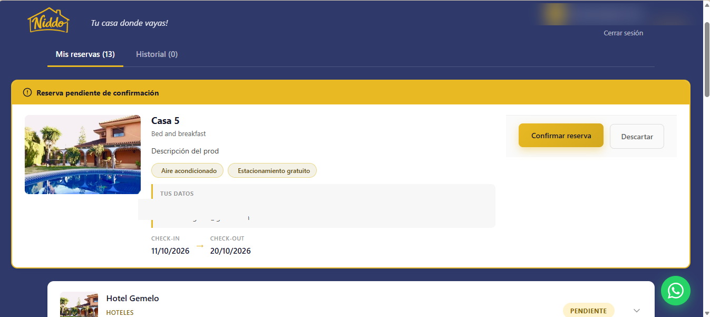
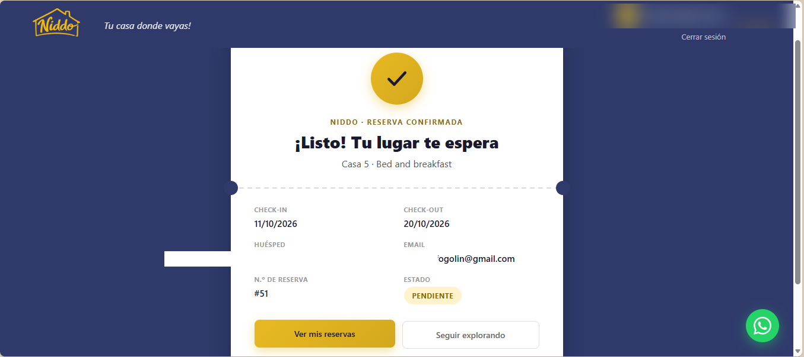

# 🏢 Niddo


Plataforma de reservas de hospedajes. Permite a los usuarios explorar alojamientos según sus intereses, hacer reservas y dejar favoritos. Admins gestionan productos, categorías, características y usuarios.

---

## ⚙️ Tecnologías

### 🖥️ Frontend
- React 19.2 + Vite 8
- React Router v7
- Bootstrap 5.3 (vía CDN en `index.html`)
- Fetch nativo (`src/config/api.js`)
- React Compiler

### ☕ Backend
- Java 17
- Spring Boot 3.3.5
- Spring Security + JWT
- Spring Data JPA
- H2 Database (archivo local) + driver MySQL disponible
- springdoc-openapi (Swagger)
- Uploads locales (`backend/uploads/productos/`)

### 🧪 Testing
- Backend: JUnit 5 + Mockito + AssertJ (`spring-boot-starter-test`)
- Frontend: Vitest 5 + React Testing Library 16 + jsdom

---

## 🚀 Instalación local

### 1. Requisitos previos
- Node.js 20+
- Java 17+
- Maven 3.9+

> [!NOTE]
> No se necesita MySQL ni Docker para correr el proyecto por defecto (usa H2 en archivo).

### 2. Cloná el repositorio
```bash
git clone https://github.com/EstebanFogolin/niddo.git
cd niddo
```

### 3. Corré el backend
```bash
cd backend
mvn spring-boot:run
```
> El backend queda disponible en `http://localhost:8080`

### 4. Corré el frontend (en otra terminal, desde la raíz)
```bash
npm install
npm run dev
```
> La aplicación queda disponible en `http://localhost:5173`

### 5. Crear el primer admin
El registro siempre crea usuarios `USER`. Para promover el primero a `ADMIN`:
1. Abrí la consola H2 en `http://localhost:8080/h2-console` (JDBC `jdbc:h2:file:./data/reservas`, usuario `sa`, sin contraseña).
2. Ejecutá: `UPDATE USUARIO SET ROLE='ADMIN' WHERE EMAIL='tu@email.com';`
3. Volvé a iniciar sesión. Alternativa (con un admin existente): `PUT /api/admin/usuarios/{id}/role`.

---

## 🗄️ Base de datos

### Opción por defecto: H2 (sin configuración)
- Archivo: `backend/data/reservas.mv.db` (se crea solo)
- Consola: `http://localhost:8080/h2-console`
- Esquema: `ddl-auto=update` (se genera desde las entidades, sin migraciones)
- Datos iniciales: `backend/src/main/resources/import.sql` (4 productos de ejemplo con imágenes)

### Opción MySQL (opcional)
```sql
CREATE DATABASE niddo;
```
Luego apuntá el datasource a MySQL y definí las variables de entorno (sin valores reales en el repo):
```bash
MAIL_USERNAME=tu_email@gmail.com
MAIL_PASSWORD=tu_app_password
```

> [!NOTE]
> El registro y las reservas funcionan igual sin configurar el email (el envío es asíncrono y no bloquea).

---

## 📬 Endpoints (API REST)

| Método | Endpoint | Descripción | Auth |
|--------|----------|-------------|------|
| POST | `/api/auth/register` | Registro (siempre rol `USER`) | ❌ |
| POST | `/api/auth/login` | Login y generación de JWT | ❌ |
| POST | `/api/auth/resend-confirmation` | Reenviar email de confirmación | ❌ |
| GET | `/api/productos?q=&categoriaIds=` | Listar/buscar/filtrar productos | ❌ |
| GET | `/api/productos/{id}` | Detalle de producto | ❌ |
| POST / PUT / DELETE | `/api/productos...` | Crear/editar/eliminar (multipart) | ✅ ADMIN |
| GET | `/api/categorias`, `/api/caracteristicas` | Listar | ❌ |
| POST / PUT / DELETE | `/api/categorias...`, `/api/caracteristicas...` | Gestionar | ✅ ADMIN |
| GET | `/api/reservas/producto/{id}/disponibilidad?desde=&hasta=` | Disponibilidad | ❌ |
| POST | `/api/reservas` | Crear reserva | ✅ |
| GET | `/api/reservas/mis-reservas` | Mis reservas | ✅ |
| DELETE | `/api/reservas/{id}` | Cancelar reserva | ✅ |
| POST / GET / DELETE | `/api/favoritos/toggle`, `/api/favoritos` | Favoritos | ✅ |
| GET | `/api/resenas/productos/{id}`, `.../rating` | Reseñas y rating | ❌ |
| POST / PUT / DELETE | `/api/resenas...` | Crear/editar/eliminar reseña | ✅ |
| GET / PUT | `/api/admin/usuarios`, `/api/admin/usuarios/{id}/role` | Gestión de usuarios | ✅ ADMIN |

Crear producto (`multipart/form-data`): campos `nombre`, `descripcion`, `categoriaId`, `caracteristicas` (lista de ids), `contactoEmail`, `contactoTelefono`, `imagenes` (archivos, requeridos en POST).

Los errores usan el formato `{"mensaje": "..."}`. Nombre duplicado → `409 Conflict`.

> 📌 Swagger disponible en `http://localhost:8080/swagger-ui/index.html`

---

## 🗂️ Diagrama de Entidades (ER)



> Fuente: entidades JPA en `backend/.../com.digitalhouse.reservas`. Editable en `docs/niddo-er.drawio`. Ver [dbdiagram.io](https://dbdiagram.io) para diagramas online y la [guía Markdown](https://www.markdownguide.org) como referencia.

---

## 🧪 Testing

### Backend (14 tests ✅)
Unitarios con JUnit 5 + Mockito: `AuthService` (registro/login/errores), `ReservaService` (solapamientos, fechas, permisos), `ProductoService` (duplicados, búsqueda) y `GlobalExceptionHandler` (contrato `{"mensaje"}` + códigos HTTP).
```bash
cd backend
mvn test
```

### Frontend (9 tests ✅)
Vitest + React Testing Library: `resolveImageUrl`, guard `RequireAuth` y `SearchBlock`.
```bash
npm test
```

---

## 📸 Capturas de pantalla

Flujo principal del sistema funcionando:

### Home: búsqueda por nombre y fechas


### Detalle: calendario de disponibilidad y soporte por WhatsApp


### Mis reservas pendientes de confirmación


### Reserva confirmada


---

## 👤 Autores

- [@EstebanFogolin](https://github.com/EstebanFogolin)

---

## 📞 Soporte
¿Encontraste un bug o tenés una sugerencia?

- 🐛 Reportar bug (issues del repo)
- 💡 Solicitar feature (issues del repo)
- 📧 Email: soporte@niddo.com
